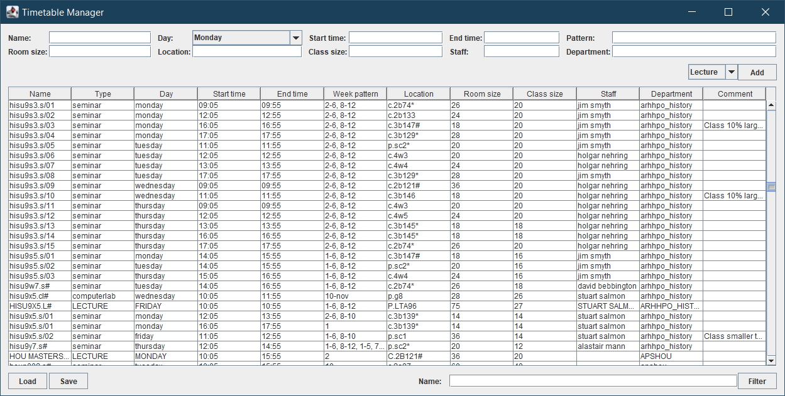
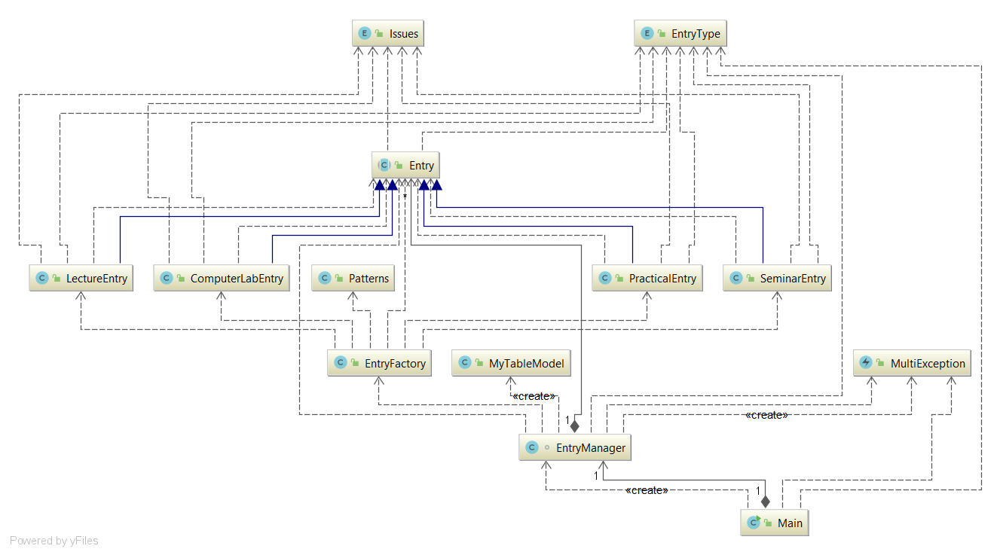
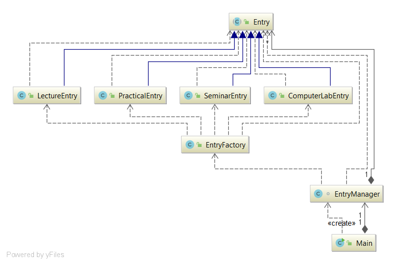

# Timetable Manager
A simple timetable manager, written for a university assignment project.

Provides a flexible GUI capable of reading, filtering and adding timetable entries, as well as exporting them to an HTML table.

## Features
* Flexible, scalable GUI based on Java's Swing and GridBagLayout
* Multi data import from CSV
* Entry filtering
* Entry adding
* Data export to HTML table
* Robust handling of errors and malformatted input
* Helpful messages
* Clean, robust OOP model

## Screenshots

## Building
Run `maven package` (or `mvn` for Windows)

## Design
The global UML diagram looks like this:

The `Main` class initializes the GUI and handles exceptions. There are three misc classes that are used throughout the program:
* `Patterns` - regex patterns used to match and validate data
* `MyTableModel` - a custom table model with non-editable cells
* `MultiException` - a custom exception that an hold multiple exceptions

Data I/O and display is managed by `EntryManager`, which internally holds a list of `Entry`. `Entry` is an abstract class that can either be a `ComputerLabEntry`, `LectureEntry` or `PracticalEntry` or `SeminarEntry`. This is visualized below:

Each of the inheriting classes overrides a few key methods to comply with the project requirements. They are outlined below:

